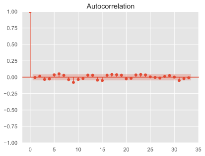

## Question

In the excel file

- Column 1 provides a time period over which data is collected
- Column 2 provides the heart rate of a patient recorded over time. 

Use an appropriate ARIMA model to forecast the heart rate of this patient.

**Note**
Your response to each question must be supported by the results/estimates you obtain from estimation of the above equation. You are required to submit this sheet with answers/responses (and if needed, supported by excel sheets)

[toc]

## Pretext

### Given Data

The following is the data provided.

|      |                Time | Heart Rate |
| ---: | ------------------: | ---------- |
|    0 |            12:00:00 | 84.2500    |
|    1 |            13:00:00 | 84.2500    |
|    2 |            14:00:00 | 84.0625    |
|    3 |            15:00:00 | 85.6250    |
|    4 |            16:00:00 | 87.1875    |
|  ... |                 ... | ...        |
| 1795 | 1900-03-15 07:00:00 | 103.8125   |
| 1796 | 1900-03-15 08:00:00 | 101.6250   |
| 1797 | 1900-03-15 09:00:00 | 99.5625    |
| 1798 | 1900-03-15 10:00:00 | 99.1875    |
| 1799 | 1900-03-15 11:00:00 | 98.8750    |

### Pre-Processing

I performed some pre-processing to fix some errors associated with the time column format in `.xlsx` sheet, to end up with this.

|      |                Time | Heart Rate |
| ---: | ------------------: | ---------- |
|    0 | 2022-01-01 12:00:00 | 84.2500    |
|    1 | 2022-01-01 13:00:00 | 84.2500    |
|    2 | 2022-01-01 14:00:00 | 84.0625    |
|    3 | 2022-01-01 15:00:00 | 85.6250    |
|    4 | 2022-01-01 16:00:00 | 87.1875    |
|  ... |                 ... | ...        |
| 1795 | 2022-03-17 07:00:00 | 103.8125   |
| 1796 | 2022-03-17 08:00:00 | 101.6250   |
| 1797 | 2022-03-17 09:00:00 | 99.5625    |
| 1798 | 2022-03-17 10:00:00 | 99.1875    |
| 1799 | 2022-03-17 11:00:00 | 98.8750    |

### Visualization

## Question 1

Formulate a relevant null and alternative hypothesis to estimate the impact of the lagged variables. Carry out a unit root test for this series and examine if it is stationary?

Using Augmented Dicky-Fuller test,

- $H_0: \gamma=1$ (Non-Stationary)
- $H_1: \gamma \ne 1$ (Stationary)

If p value $\le 0.05$

- we reject null hypothesis and accept alternate hypothesis
- process is stationary

| Statistic           | Value    |
| ------------------- | -------- |
| p-value             | 0.00003  |
| t value             | -4.96788 |
| 1% Critical Region  | -3.43402 |
| 5% Critical Region  | -2.86316 |
| 10% Critical Region | -2.56763 |

In my result, I got p-value $<< 0.05 \implies$ process is stationary

## Question 2

Identify the appropriate ARIMA model which can be used for forecasting the actual future heart rate? (Use t-test). Interpret these coefficients.

I used $z$ test, instead of $t$ test, and found that lags 1, 2, and 3 are statistically-signficant. This is also visible from the correlogram.

|                  |                  |                   |           |
| ---------------: | ---------------: | ----------------- | --------- |
|   Dep. Variable: |       Heart Rate | No. Observations: | 1800      |
|           Model: |   ARIMA(3, 0, 0) | Log Likelihood    | -3041.628 |
|            Date: | Fri, 23 Dec 2022 | AIC               | 6093.255  |
|            Time: |         22:27:56 | BIC               | 6120.733  |
|          Sample: |                0 | HQIC              | 6103.398  |
|                  |           - 1800 |                   |           |
| Covariance Type: |              opg |                   |           |

|        |    coef | std err |       z | P>\|z\| | [0.025 | 0.975] |
| -----: | ------: | ------: | ------: | ------: | -----: | ------ |
|  const | 92.5923 |   0.814 | 113.723 |   0.000 | 90.997 | 94.188 |
|  ar.L1 |  1.3264 |   0.008 | 161.655 |   0.000 |  1.310 | 1.342  |
|  ar.L2 | -0.4632 |   0.028 | -16.532 |   0.000 | -0.518 | -0.408 |
|  ar.L3 |  0.0973 |   0.027 |   3.627 |   0.000 |  0.045 | 0.150  |
| sigma2 |  1.7161 |   0.014 | 119.613 |   0.000 |  1.688 | 1.744  |

|                         |      |                   |           |
| ----------------------: | ---: | ----------------- | --------- |
|     Ljung-Box (L1) (Q): | 0.04 | Jarque-Bera (JB): | 248894.27 |
|                Prob(Q): | 0.84 | Prob(JB):         | 0.00      |
| Heteroskedasticity (H): | 1.13 | Skew:             | -1.43     |
|    Prob(H) (two-sided): | 0.12 | Kurtosis:         | 60.54     |

Hence, I identified $AR(3)$ as the most appropriate model.

$$
\begin{align}
y_t &= \beta_0 + \beta_1 y_{t-1} + \beta_2 y_{t-2} + \beta_2 y_{t-3} + u_t \\
&= \beta_0 + \sum_{i=1}^3 \beta_i y_{t-i} + u_t
\end{align}
$$

## Question 3

Compare a simple basic ARIMA (1,0,0) model with the model identified and proposed by you; and suggest a model which has better forecasting accuracy. (use RMSE estimates)

The model which has the lowest rmse for both insample and outsample prediction is ARIMA(3, 0, 0); hence it is the proposed model.

| Model                                             |     RMSE |
| ------------------------------------------------- | -------: |
| Insample Prediction Heart Rate using ARIMA(3,0,0) | 1.309519 |
| Insample Prediction Heart Rate using ARIMA(1,0,0) | 1.397753 |
| Outsample Prediction Heart Rate ARIMA(3,0,0)      | 2.081262 |
| Outsample Prediction Heart Rate ARIMA(1,0,0)      | 2.081938 |

## Question 4

Also, Compare the adjusted r-square obtained from the two competing models. 

| Model                                             | Adjusted R2 |
| ------------------------------------------------- | ----------: |
| Insample Prediction Heart Rate using ARIMA(3,0,0) |    0.939552 |
| Outsample Prediction Heart Rate ARIMA(1,0,0)      |    0.936579 |
| Outsample Prediction Heart Rate ARIMA(3,0,0)      |    0.935641 |
| Insample Prediction Heart Rate using ARIMA(1,0,0) |    0.930654 |

## Question 5

Conduct a unit root test for both the residual series obtained from the two competing models. Are they white noise?

The p value is 0, which implies that the residual series is a stationary process. From the graph in [Question 6](#Question 6), we can see that there is no autocorrelation, and hence the residual series is a white noise series.

| Error                                                   | p value | t value |
| ------------------------------------------------------- | ------: | ------: |
| Insample Prediction Residual Series using ARIMA(1,0,0)  |       0 |  -12.07 |
| Insample Prediction Residual Series using ARIMA(3,0,0)  |       0 |  -10.39 |
| Outsample Prediction Residual Series using ARIMA(3,0,0) |       0 |   -9.61 |
| Outsample Prediction Residual Series using ARIMA(1,0,0) |       0 |   -8.35 |

## Question 6

Run a test for presence of autocorrelation in the error term (Use correlogram and interpret it)

Both the graphs clearly shows that the autocorrelation lines are within the shaded bands. Hence, the total and partial autocorrelation coefficient are statistically 0, ie

$$
\begin{align}
\text{PAC}(u_t, u_{t-k}) &= 0 \\
\text{TAC}(u_t, u_{t-k}) &= 0 \\
(\forall k & \ne 0)
\end{align}
$$

## Question 7

Plot the predicted and actual values obtained from the most appropriate model. What do you infer?

The predicted value almost perfectly overlaps with true value, hence we can conclude that our model is appropriate to modelling heart rate.

The errors are also random, and mostly quite minimal.

## Question 8

Based on evidence from data, what will be your advice?

Firstly, despite the near-perfect fit, the model could be improved by incorporating seasonality, besides just the basic ARIMA modelling.

Secondly, the model could be improved by introducing other variables which have an effect on heart rate, such as mood, glucose level, etc.

Furthermore, the current model only predicts one step ahead, using a static approach. A more useful result would be to build a model for predicting the next 24 hours using a dynamic approach.
